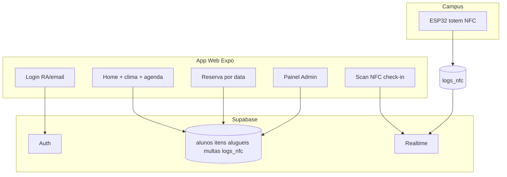

# Avaliação do UPX 7 (contexto faculdade)

## Como o projeto está hoje

O **UPX 7** é um sistema real de aluguel de **quadra** e **guarda-chuva** no campus, com app web (Expo/React Native), backend **Supabase** (Auth + Postgres + Realtime) e integração com **totem NFC** (ESP32 grava em `logs_nfc`).

### Pontos fortes (bom para banca / relatório)

| Área                  | O que vocês já têm                                                                             |
| --------------------- | ---------------------------------------------------------------------------------------------- |
| **Problema real**     | Fila, conflito de horário, guarda-chuva e quadra no mesmo ecossistema                          |
| **Stack atual**       | TypeScript, Expo web, Supabase, deploy Vercel — stack comum em mercado                         |
| **Segurança**         | RLS por aluno + `is_admin()`; multas via trigger `gerar_multa()`                               |
| **Regras de negócio** | Aluguel imediato vs reserva `agendado`; check-in NFC na janela; no-show; multa só guarda-chuva |
| **UX recente**        | Tab bar customizada, tela de reserva redesenhada, clima no campus, histórico e multas          |
| **Admin**             | Dashboard + gestão de aluguéis, itens, alunos e multas                                         |
| **IoT**               | Fluxo documentado: cartão NFC → `logs_nfc` → Realtime → ativação da reserva                    |

Arquivos que representam bem o escopo: [`App.tsx`](App.tsx), [`StudentNavigator.tsx`](src/navigation/StudentNavigator.tsx), [`HomeScreen.tsx`](src/screens/HomeScreen.tsx), [`QuadraReservaScreen.tsx`](src/screens/QuadraReservaScreen.tsx), [`useQuadraCheckIn.ts`](src/hooks/useQuadraCheckIn.ts), migrações em [`supabase/migrations/`](supabase/migrations/).

### O que ainda incompleto ou frágil

| Lacuna                              | Impacto na faculdade                                                                                                                                                     |
| ----------------------------------- | ------------------------------------------------------------------------------------------------------------------------------------------------------------------------ |
| **Sem README**                      | Professor/orientador não roda o projeto em 5 min                                                                                                                         |
| **Sem testes**                      | Difícil provar qualidade e regressão após mudanças (navbar, Realtime, etc.)                                                                                              |
| **Schema base não versionado**      | Só migrações incrementais; reproduzir ambiente do zero é trabalhoso                                                                                                      |
| **Types Supabase desatualizados**   | [`supabase.generated.ts`](src/types/supabase.generated.ts) atrás de `admins` e campos manuais em [`database.ts`](src/types/database.ts)                                  |
| **Foco web**                        | `app.json` só web; APK/iOS seria “trabalho futuro” explícito                                                                                                             |
| **Telas muito grandes**             | `HomeScreen` (~666 linhas), `QuadraReservaScreen` (~630) — manutenção e code review                                                                                      |
| **Lógica duplicada cliente/DB**     | Ex.: dedupe de reservas, no-show, timing da quadra no [`useAlugueis.ts`](src/hooks/useAlugueis.ts) + triggers/índices                                                    |
| **Seeds com senhas nas migrations** | Aceitável em dev; **nunca** em produção real sem aviso no relatório                                                                                                      |
| **Dívida web recente**              | Tab bar com `zIndex`, Realtime centralizado em [`alugueisRealtime.ts`](src/lib/alugueisRealtime.ts), `paddingBottom` da cena removido — conteúdo pode encostar na navbar |

---

## O que melhorar (priorizado para projeto de faculdade)

### Prioridade alta (impacto em nota + demo)

1. **README acadêmico** — problema, stack, `.env.example`, `npm run dev`, usuários de teste (sem senha real), fluxo de demo em 5 passos, link Vercel.
2. **Roteiro de demonstração** — 3 minutos: login aluno → reservar quadra → simular NFC → admin vê aluguel → multa guarda-chuva.
3. **Diagrama no relatório** — arquitetura (app ↔ Supabase ↔ ESP32); pode reutilizar o fluxo acima.
4. **Regenerar tipos Supabase** — `supabase gen types` e alinhar `database.ts` (mostra maturidade com backend).
5. **Migration inicial ou dump documentado** — “como recriar o banco do zero” para o orientador.

### Prioridade média (qualidade técnica)

6. **Testes mínimos** — 3–5 testes em funções puras: [`quadraAvailability.ts`](src/utils/quadraAvailability.ts), [`quadraReserva.ts`](src/lib/quadraReserva.ts), formatação de datas.
7. **Extrair componentes** — grade de horários e card de reserva saem de `HomeScreen` / `QuadraReservaScreen`.
8. **Padding consistente acima da tab bar** — usar `getStudentTabBarInset()` do [`StudentTabBar.tsx`](src/navigation/StudentTabBar.tsx) só no `contentContainerStyle` dos `ScrollView`, não no `sceneStyle` inteiro.
9. **Unificar alertas na web** — trocar `Alert` restante por [`alert.web.ts`](src/utils/alert.web.ts).
10. **Checklist de segurança no relatório** — RLS, o que o `anon` pode/não pode, papel do admin.

### Prioridade baixa (se sobrar tempo)

11. CI simples (GitHub Actions: `tsc --noEmit` + build web).
12. Admin: criar item/aluno pela UI (hoje só toggles).
13. PWA / ícone e nome na aba (já tem `document.title`).

---

## Ideias extras (diferenciais na apresentação)

Ideias que **não são obrigatórias**, mas impressionam em TCC/PI se couber no escopo:

| Ideia                                             | Por que vale na faculdade                                            |
| ------------------------------------------------- | -------------------------------------------------------------------- |
| **Notificação / e-mail** (Resend + Edge Function) | “Lembrete: reserva amanhã às 9h” ou multa gerada                     |
| **QR code no lugar do NFC** (fallback)            | Demo sem hardware: admin gera código de check-in                     |
| **Painel “ocupação da quadra”**                   | Gráfico simples por dia/hora a partir de `alugueis`                  |
| **Modo demonstração**                             | Botão admin que simula insert em `logs_nfc` para banca sem ESP32     |
| **Relatório PDF de histórico**                    | Export do histórico do aluno (web `print` ou PDF)                    |
| **Política de multas transparente**               | Tela explicando R$ X após Y min (já tem multas; falta UX educativa)  |
| **Acessibilidade**                                | Labels, contraste, foco no teclado (web) — pontua em critérios de UX |
| **App mobile nativo**                             | Trabalho futuro explícito; mesmo código Expo, outro target           |

Para **guarda-chuva**, o fluxo já existe; para **quadra**, o diferencial é reserva + NFC — isso deve ser o **fio narrativo** da apresentação.

---

## Sugestão de narrativa para a banca

1. **Contexto** — Facens, quadra ao ar livre, guarda-chuva, fila e conflitos.
2. **Solução** — App único: alugar agora, reservar data, check-in no totem, multas automáticas (guarda-chuva).
3. **Tecnologia** — Supabase (segurança RLS), Realtime (atualização ao vivo), web responsiva tipo celular ([`WebLayout.tsx`](src/components/WebLayout.tsx)).
4. **Demonstração ao vivo** — caminho feliz + um caso de erro (horário ocupado / sem check-in).
5. **Limitações honestas** — web-first, dependência do totem, seeds só em ambiente de desenvolvimento.
6. **Trabalhos futuros** — app nativo, pagamento PIX das multas, notificações push.

---

## Veredito resumido

O projeto **já está em nível apresentável** para faculdade: funcionalidade de ponta a ponta, backend com regras reais e integração física (NFC). O que mais falta para “projeto redondo” não é feature nova, e sim **documentação, demo ensaiada, testes pontuais e organização do código** — isso costuma pesar tanto quanto mais uma tela na nota.

Não é necessário implementar tudo da lista; para entrega típica, **README + roteiro de demo + diagrama + 1 página de segurança (RLS)** costumam ser o melhor custo-benefício.
